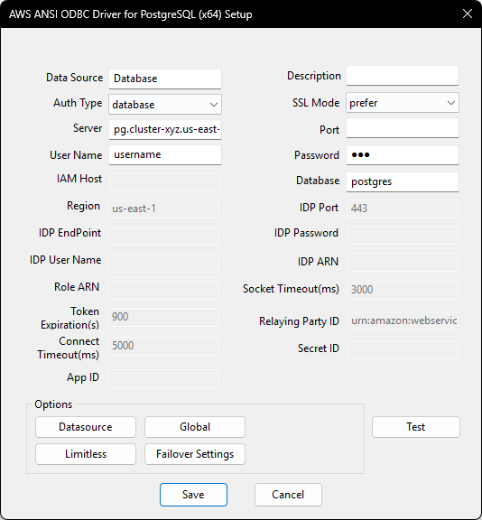
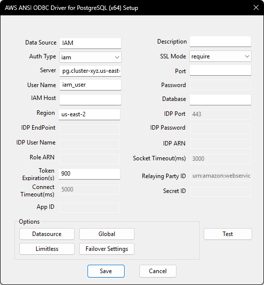

# Authentication types supported by PostgreSQL ODBC driver

The driver supports 3 types of authentication. 
1. Database authentication.
2. IAM database authentication.
3. ADFS authentication.

You can choose the authentication method by specifying the `AuthType` connection option.

| Authentication          | AuthType     |
|-------------------------|--------------|
| Database authentication | `database`   |
| IAM authentication      | `iam`        |
| ADFS authentication     | `adfs`       |

## Database Authentication
Database authentication uses the database username and password for authentication.

The following connection options are required when using database authentication.

| Field     | Connection Option |                   Value                    |  Default Value |
|-----------|-------------------|--------------------------------------------|----------------|
| Auth Type | AuthType          | Should be `database`                       |   `database`   |
| Server    | Server            | PostgreSQL instance server name            |    Null        |
| Port      | Port              | Port that the database is listening on     |    Null        |
| User Name | UserName          | Database user name                         |    Null        |
| Password  | Password          | Database user password                     |    Null        |
| Database  | Database          | Default database that a user will work on  |    Null        |
| SSL Mode  | SSLMode           | The authentication SSL mode                |   `disable`    |

### DSN Window Example

## IAM Authentication

### What is IAM?
AWS Identity and Access Management (IAM) grants users access control across all Amazon Web Services. IAM supports granular permissions, giving you the ability to grant different permissions to different users. For more information on IAM and its use cases, please refer to the [IAM documentation](https://docs.aws.amazon.com/IAM/latest/UserGuide/introduction.html).

### Enable AWS IAM Database Authentication
To support AWS IAM authentication, the following steps should be finish firstly for a PostgreSQL instance on AWS.

1. Enable AWS IAM database authentication on an existing database or create a new database with AWS IAM database authentication on the AWS RDS Console:
    1. If needed, review the documentation about [creating a new database](https://docs.aws.amazon.com/AmazonRDS/latest/UserGuide/USER_CreateDBInstance.html).
    2. If needed, review the documentation about [modifying an existing database](https://docs.aws.amazon.com/AmazonRDS/latest/UserGuide/Overview.DBInstance.Modifying.html).
2. Set up an [AWS IAM policy](https://docs.aws.amazon.com/AmazonRDS/latest/UserGuide/UsingWithRDS.IAMDBAuth.IAMPolicy.html) for AWS IAM database authentication.
3. [Create a database account](https://docs.aws.amazon.com/AmazonRDS/latest/UserGuide/UsingWithRDS.IAMDBAuth.DBAccounts.html) using AWS IAM database authentication. This will be the user specified in the connection string or DSN window. Use the following command to create a new user: 
    `CREATE USER db_userx;
     GRANT rds_iam TO db_userx;`

### DSN window configuration for IAM authentication
The following DSN fields on a DSN window should be filled when using IAM authentication.

| Field            | Connection Option         |                        Value                                          |  Default Value |
|------------------|---------------------------|:---------------------------------------------------------------------:|----------------|
| Auth Type        | AuthType                  | Should be `iam`                                                       |   `database`   |
| Server           | Server                    | PostgreSQL instance server name                                       |    Null        |
| Port             | Port                      | Port that the database is listening on                                |    Null        |
| User Name        | UserName                  | Database user name for IAM authentication                             |    Null        |
| Region           | Region                    | The region of the IAM authentication                                  |    Null        |
| Database         | Database                  | Default database that a user will work on                             |    Null        |
| SSL Mode         | SSLMode                   | The authentication SSL mode, should be `allow`, `prefer` or `require` |   `disable`    |
| Token Expiration | TokenExpiration           | Token expiration in seconds, supported max value is 900               |    900         |

### DSN Window Example

## ADFS Authentication
The driver supports authentication via a federated identity and then database access via IAM. Currently Microsoft Active Directory Federation Services (AD FS) is supported as a federation authentication.

### What is Federated Identity
Federated Identity allows users to use the same set of credentials to access multiple services or resources across different organizations. This works by having Identity Providers (IdP) that manage and authenticate user credentials, and Service Providers (SP) that are services or resources that can be internal, external, and/or belonging to various organizations. Multiple SPs can establish trust relationships with a single IdP.

When a user wants access to a resource, it authenticates with the IdP. From this a security token generated and is passed to the SP then grants access to said resource.
In the case of AD FS, the user signs into the AD FS sign in page. This generates a SAML Assertion which acts as a security token. The user then passes the SAML Assertion to the SP when requesting access to resources. The SP verifies the SAML Assertion and grants access to the user. 

### Enable ADFS Authentication
1. Follow steps in `Enable AWS IAM Database Authentication` to setup IAM authentication.
2. Set up an IAM Identity Provider and IAM role. The IAM role should be using the IAM policy set up in step 1. 
   - If needed, review the documentation about [creating IAM identity providers](https://docs.aws.amazon.com/IAM/latest/UserGuide/id_roles_providers_create.html). For AD FS, see the documention about [creating IAM SAML identity providers](https://docs.aws.amazon.com/IAM/latest/UserGuide/id_roles_providers_create_saml.html).

### DSN window configuration for ADFS authentication
The following DSN fields on a DSN window should be filled when using ADFS authentication.

| Field              | Connection Option         |                        Value                                           |  Default Value           |
|--------------------|---------------------------|:----------------------------------------------------------------------:|--------------------------|
| Auth Type          | AuthType                  | Should be `adfs`                                                       |   `database`             |
| Server             | Server                    | PostgreSQL instance server name                                        |    Null                  |
| Port               | Port                      | Port that the database is listening on                                 |    Null                  |
| User Name          | UserName                  | Database user name for IAM authentication                              |    Null                  |
| Region             | Region                    | The region of the IAM authentication                                   |   `us-east-1`            |
| Database           | Database                  | Default database that a user will work on                              |    Null                  |
| SSL Mode           | SSLMode                   | The authentication SSL mode, should be `allow`, `prefer` or `require`  |   `disable`              |
| Token Expiration   | TokenExpiration           | Token expiration in seconds, supported max value is 900                |    900                   |
| IDP Endpoint       | IDPEndpoint               | The ADFS host that is used to authenticate into AWS PostgreSQL         |    Null                  |
| IDP Port           | IDPPort                   | The ADFS host port                                                     |    Null                  |
| IDP User Name      | IDPUserName               | The user name for the IDP Endpoint server                              |    Null                  |
| IDP Password       | IDPPassword               | The IDP user password                                                  |    Null                  |
| Role ARN           | IDPRoleArn                | The ARN of the IAM Role that is to be assumed to access AWS PostgreSQL |    Null                  |
| IDP ARN            | IDPArn                    | The ARN of the Identity Provider                                       |    Null                  |
| Socket Timeout     | SocketTimeout             | The socket timeout value in milliseconds for the HttpClient reading    |    3000                  |
| Connect Timeout    | ConnTimeout               | The connect timeout value in milliseconds for the HttpClient           |    5000                  |
| Relaying Party ID  | ReplayingPartyId          | The relaying party identifier                                          | `urn:amazon:webservices` |

### DSN Window Example
