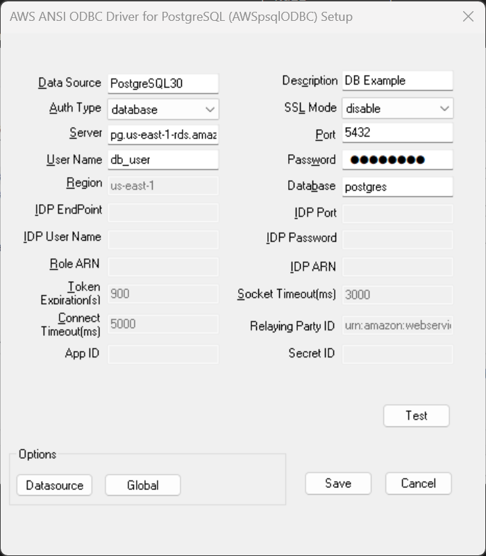

## Database Authentication
Database authentication uses the database username and password for authentication.

### DSN Window Configuration for Database Authentication
The following connection options are required when using Database authentication.

| Field     | Connection Option | Value                                     | Default Value | Sample Value                  |
|-----------|-------------------|-------------------------------------------|---------------|-------------------------------|
| Auth Type | AuthType          | Should be `database`                      | `database`    | `database`                    |
| Server    | Server            | PostgreSQL instance server name           | Null          | `pg.us-east-1-rds.amazon.com` |
| Port      | Port              | Port that the database is listening on    | Null          | 5432                          |
| User Name | UserName          | Database user name                        | Null          | `db_user`                     |
| Password  | Password          | Database user password                    | Null          | `my_password`                 |
| Database  | Database          | Default database that a user will work on | Null          | `postgres`                    |
| SSL Mode  | SSLMode           | The SSL authentication mode               | `disable`     | `disable`                     |

### DSN Window Example

