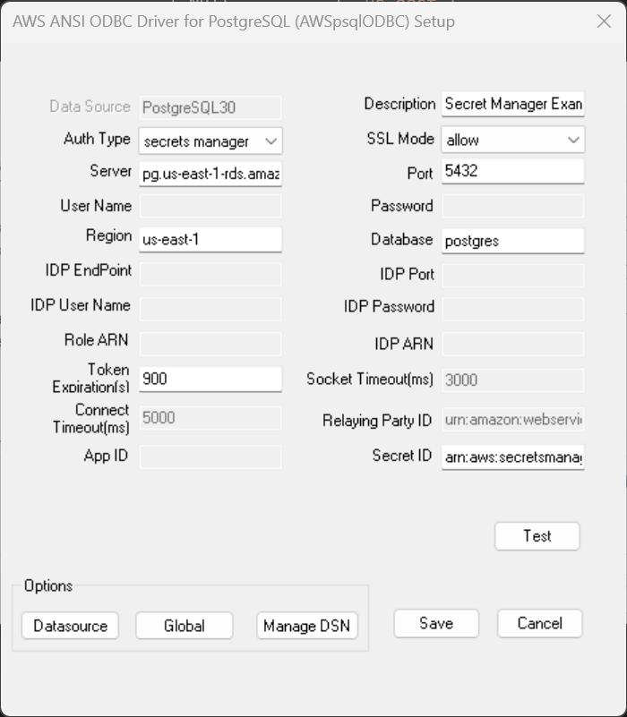

## Secret Manager Authentication

### What is Secret Manager?
AWS Secrets Manager helps manage, retrieve, and rotate database credentials. Secret Manager can also further grant granulated access through [AWS Identity and Access Management (IAM)](https://docs.aws.amazon.com/secretsmanager/latest/userguide/intro.html).
For more information on Secret Manager and its use cases, please refer to the [Secret Manager documentation](https://docs.aws.amazon.com/secretsmanager/latest/userguide/intro.html).

### Enable Secret Manager
To enable AWS Secret Manager authentication, follow the AWS RDS documents on [Enabling master user password for DB instance](https://docs.aws.amazon.com/AmazonRDS/latest/UserGuide/rds-secrets-manager.html#rds-secrets-manager-db-instance)

### DSN Window Configuration for Secret Manager Authentication
The following DSN fields on the DSN window should be filled when using Secret Manager authentication.

| Field             | Connection Option | Value                                                   | Default Value | Sample Value                                                              |
|-------------------|-------------------|---------------------------------------------------------|---------------|---------------------------------------------------------------------------|
| Auth Type         | AuthType          | Should be `secrets-manager`                              | `database`    | `secrets-manager`                                                          |
| Server            | Server            | PostgreSQL instance server name                         | Null          | `pg.us-east-1-rds.amazon.com`                                             |
| Port              | Port              | Port that the database is listening on                  | Null          | 5432                                                                      |
| Region            | Region            | The region of the Secret Manager                        | Null          | `us-east-1`                                                               |
| Database          | Database          | Default database that a user will work on               | Null          | `postgres`                                                                |
| SSL Mode          | SSLMode           | The authentication SSL mode, cannot be `disable`        | `disable`     | `allow`                                                                   |
| Token Expiration  | TokenExpiration   | Token expiration in seconds, supported max value is 900 | 900           | 900                                                                       |
| Secret Id         | SecretId          | Secret ID which holds the database credentials          | Null          | `arn:aws:secretsmanager:us-west-2:123412341234:secret:rds!cluster-UUID`   |

### DSN Window Example

