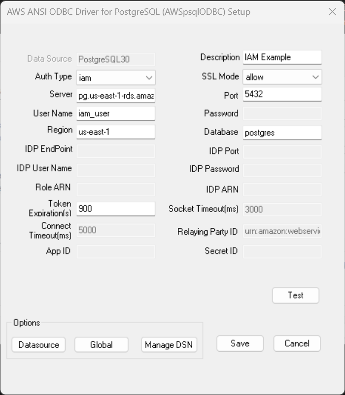

## IAM Authentication

### What is IAM?
AWS Identity and Access Management (IAM) grants users access control across all Amazon Web Services. IAM supports granular permissions, giving you the ability to grant different permissions to different users. For more information on IAM and its use cases, please refer to the [IAM documentation](https://docs.aws.amazon.com/IAM/latest/UserGuide/introduction.html).

### Enable AWS IAM Database Authentication
To enable AWS IAM authentication, the following steps should be completed first for a PostgreSQL instance on AWS.

1. Enable AWS IAM database authentication on an existing database or create a new database with AWS IAM database authentication on the AWS RDS Console:
    1. If needed, review the documentation about [creating a new database](https://docs.aws.amazon.com/AmazonRDS/latest/UserGuide/USER_CreateDBInstance.html).
    1. If needed, review the documentation about [modifying an existing database](https://docs.aws.amazon.com/AmazonRDS/latest/UserGuide/Overview.DBInstance.Modifying.html).
1. Set up an [AWS IAM policy](https://docs.aws.amazon.com/AmazonRDS/latest/UserGuide/UsingWithRDS.IAMDBAuth.IAMPolicy.html) for AWS IAM database authentication.
1. [Create a database account](https://docs.aws.amazon.com/AmazonRDS/latest/UserGuide/UsingWithRDS.IAMDBAuth.DBAccounts.html) using AWS IAM database authentication. This will be the user specified in the connection string or DSN window. Use the following SQL Commands to create a new user:<br>
```
CREATE USER iam_user;
GRANT rds_iam TO iam_user;
```

### DSN Window Configuration for IAM Authentication
The following DSN fields on a DSN window should be filled when using IAM authentication.

| Field             | Connection Option  | Value                                                                    | Default Value | Sample Value                  |
|-------------------|--------------------|--------------------------------------------------------------------------|---------------|-------------------------------|
| Auth Type         | AuthType           | Should be `iam`                                                          | `database`    | `iam`                         |
| Server            | Server             | PostgreSQL instance server name                                          | Null          | `pg.us-east-1-rds.amazon.com` |
| Port              | Port               | Port that the database is listening on                                   | Null          | 5432                          |
| User Name         | UserName           | Database user name for IAM authentication                                | Null          | `iam_user`                    |
| Region            | Region             | The region of the IAM authentication                                     | Null          | `us-east-1`                   |
| Database          | Database           | Default database that a user will work on                                | Null          | `postgres`                    |
| SSL Mode          | SSLMode            | The authentication SSL mode, should be `allow`, `prefer` or `require`    | `disable`     | `allow`                       |
| Token Expiration  | TokenExpiration    | Token expiration in seconds, supported max value is 900                  | 900           | 900                           |

### DSN Window Example

