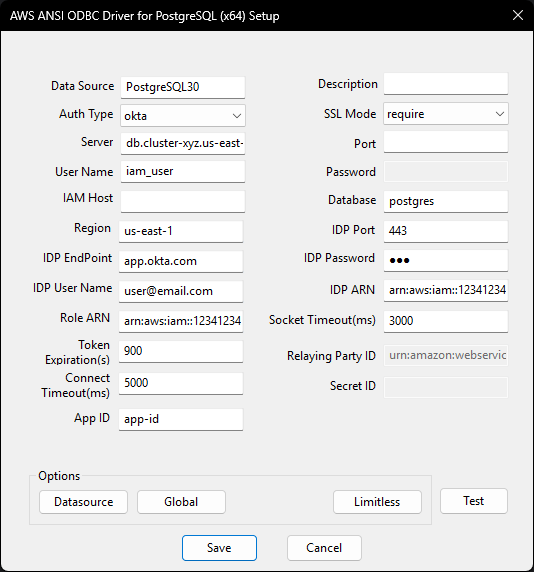

## Okta Authentication
The driver supports authentication via an [Okta](https://www.okta.com/) federated identity and then database access via IAM.

However, the driver does not support 2FA. To disable 2FA for specific users or a groups, please read [Okta's article](https://support.okta.com/help/s/article/Exclude-from-OKta-Verify-MFA-user-doesn-t-have-a-phone?language=en_US) on how to do so.

### What is Federated Identity
Federated Identity allows users to use the same set of credentials to access multiple services or resources across different organizations. This works by having Identity Providers (IdP) that manage and authenticate user credentials, and Service Providers (SP) that are services or resources that can be internal, external, and/or belonging to various organizations. Multiple SPs can establish trust relationships with a single IdP.

When a user wants access to a resource, it authenticates with the IdP. From this, a security token generated and passed to the Service Providers (SP), which grants access to the specific resource. In the case of Okta, the user signs into their Okta application sign in page. This generates a SAML Assertion which acts as a security token. The user then passes the SAML Assertion to the SP when requesting access to resources. The SP verifies the SAML Assertion and grants access to the user.

### Enable Okta Authentication
1. Follow steps in `Enable AWS IAM Database Authentication` to setup IAM authentication.
1. Configure Okta as the AWS identity provider following [Okta's official documentation](https://help.okta.com/en-us/content/topics/deploymentguides/aws/aws-deployment.htm)

### DSN Window Configuration for Okta Authentication
The following DSN fields on a DSN window should be filled when using Okta authentication.

| Field            | Connection Option | Value                                                                                                                                             | Default Value | Sample Value                                           |
|------------------|-------------------|---------------------------------------------------------------------------------------------------------------------------------------------------|---------------|--------------------------------------------------------|
| Auth Type        | AuthType          | Should be `okta`                                                                                                                                  | `database`    | `okta`                                                 |
| Server           | Server            | PostgreSQL instance server name                                                                                                                   | Null          | `pg.us-east-1-rds.amazon.com`                          |
| Port             | Port              | Port that the database is listening on                                                                                                            | Null          | 5432                                                   |
| User Name        | UserName          | Database user name for IAM authentication                                                                                                         | Null          | `iam_user`                                             |
| IAM Host         | IamHost           | The endpoint used to generate the authentication token. This is only required if you are connecting using custom endpoints such as an IP address. | Null          | `pg.us-east-1-rds.amazon.com`                          |
| Region           | Region            | The region of the IAM authentication                                                                                                              | `us-east-1`   | `us-east-1`                                            |
| Database         | Database          | Default database that a user will work on                                                                                                         | Null          | `postgres`                                             |
| SSL Mode         | SSLMode           | The authentication SSL mode, should be `allow`, `prefer` or `require`                                                                             | `disable`     | `allow`                                                |
| Token Expiration | TokenExpiration   | Token expiration in seconds, supported max value is 900                                                                                           | 900           | 900                                                    |
| IDP Endpoint     | IDPEndpoint       | The Okta host that is used to authenticate into AWS PostgreSQL                                                                                    | Null          | `my-app-name.okta.com`                                 |
| IDP Port         | IDPPort           | The Okta host port                                                                                                                                | 443           | 443                                                    |
| IDP User Name    | IDPUserName       | The user name for the IDP Endpoint server                                                                                                         | Null          | `user@email.com`                                       |
| IDP Password     | IDPPassword       | The IDP user password                                                                                                                             | Null          | `my_password`                                          |
| Role ARN         | IDPRoleArn        | The ARN of the IAM Role that is to be assumed to access AWS PostgreSQL                                                                            | Null          | `arn:aws:iam::123412341234:role/Okta-SAML-Assume`      |
| IDP ARN          | IDPArn            | The ARN of the Identity Provider                                                                                                                  | Null          | `arn:aws:iam::123412341234:saml-provider/Okta-AWS-IAM` |
| Socket Timeout   | SocketTimeout     | The socket timeout value in milliseconds for the HttpClient reading                                                                               | 3000          | 3000                                                   |
| Connect Timeout  | ConnTimeout       | The connect timeout value in milliseconds for the HttpClient                                                                                      | 5000          | 5000                                                   |
| App ID           | AppId             | The application ID for AWS configured on Okta                                                                                                     | Null          | `my-app-id`                                            |

### DSN Window Example

### Sample Code
[Okta Authentication Example](okta_authentication_sample.cpp)
