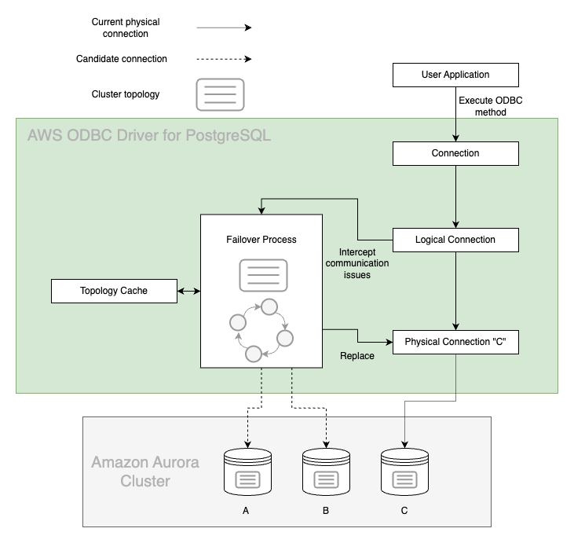
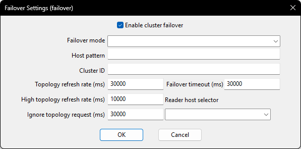
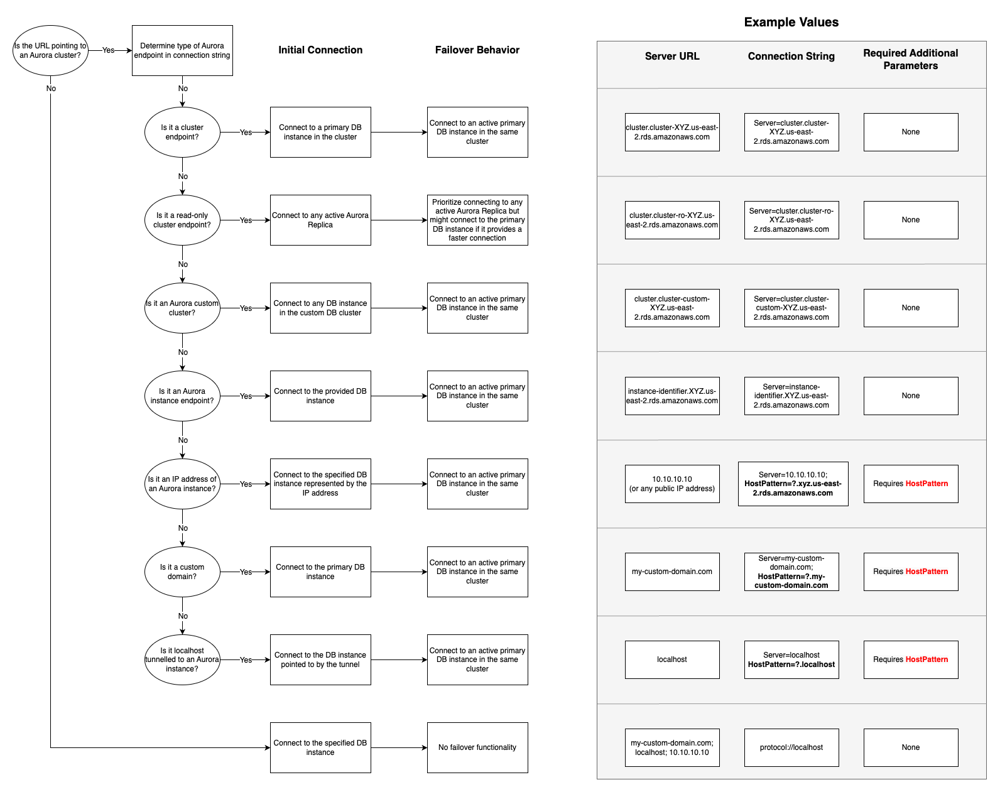

# Failover Support for the AWS ODBC Driver for PostgreSQL 

## Failover Process

In an Amazon Aurora database (DB) cluster, failover is a mechanism by which Aurora automatically repairs the DB cluster status when a primary DB instance becomes unavailable. It achieves this goal by electing an Aurora Replica to become the new primary DB instance, so that the DB cluster can provide maximum availability to a primary read-write DB instance. The AWS ODBC Driver for PostgreSQL implements failover support to coordinate with this behavior to provide minimal downtime in the event of a DB instance failure.
To learn more about Aurora cluster's failover feature see the [Amazon RDS documentation](https://docs.aws.amazon.com/AmazonRDS/latest/AuroraUserGuide/Concepts.AuroraHighAvailability.html#Aurora.Managing.FaultTolerance).

The figure above provides a simplified overview of how the AWS ODBC Driver for PostgreSQL handles an Aurora failover encounter. Starting at the top of the diagram, an application using the driver sends a request to get a logical connection to an Aurora database.

In this example, the application requests a connection using the Aurora DB cluster endpoint and is returned a logical connection that is physically connected to the primary DB instance in the DB cluster, DB instance C. By design, details about which specific DB instance the physical connection is connected to have been abstracted away.

Over the course of the application's lifetime, it executes various statements against the logical connection. If DB instance C is stable and active, these statements succeed and the application continues as normal. If DB instance C experiences a failure, Aurora will initiate failover to promote a new primary DB instance. At the same time, the AWS ODBC Driver for PostgreSQL will intercept the related communication exception and kick off its own internal failover process.

If the primary DB instance has failed, the driver will use its internal topology cache to temporarily connect to an active Aurora Replica. This Aurora Replica will be periodically queried for the DB cluster topology until the new primary DB instance is identified (DB instance A or B in this case).

At this point, the driver will connect to the new primary DB instance and return control to the application to allow the user to reconfigure the session state as needed. Although the DNS endpoint for the DB cluster might not yet resolve to the new primary DB instance, the driver has already discovered this new DB instance during its failover process, and will be directly connected to it when the application continues executing statements. In this way the driver provides a faster way to reconnect to a newly promoted DB instance, thus increasing the availability of the DB cluster.

## Failover Specific Options

| Option                       | Description                                                                                                                                                                                                                                                                                                                                                                                                                                                                                                                                                                                                                                                                                                                                                                                                                                                                                                                                                                                                                | Type  | Required                                                                                                                                        | Default                                                                                                                                          |
|------------------------------|----------------------------------------------------------------------------------------------------------------------------------------------------------------------------------------------------------------------------------------------------------------------------------------------------------------------------------------------------------------------------------------------------------------------------------------------------------------------------------------------------------------------------------------------------------------------------------------------------------------------------------------------------------------------------------------------------------------------------------------------------------------------------------------------------------------------------------------------------------------------------------------------------------------------------------------------------------------------------------------------------------------------------|-------|-------------------------------------------------------------------------------------------------------------------------------------------------|--------------------------------------------------------------------------------------------------------------------------------------------------|
| `EnableClusterFailover`      | Set to `1` to enable the fast failover behaviour offered by the AWS ODBC Driver for PostgreSQL.                                                                                                                                                                                                                                                                                                                                                                                                                                                                                                                                                                                                                                                                                                                                                                                                                                                                                                                            | bool  | No                                                                                                                                              | `0`                                                                                                                                              |
| `FailoverMode`               | Defines a mode for failover process. Failover process may prioritize nodes with different roles and connect to them. Possible values:   - `STRICT_WRITER` - Failover process tries to detect the new writer when it changes. If it cannot detect this writer within the set `FailoverTimeout` value, the driver raises an error. - `READER_OR_WRITER` - During failover, the driver tries to connect to any available/accessible reader node. If no reader is available, the driver will connect to a writer node. This logic mimics the logic of the Aurora read-only cluster endpoint. - `STRICT_READER` - During failover, the driver tries to connect to any available reader node. If no reader is available, the driver raises an error. Reader failover to a writer node will only be allowed for single-node clusters. This logic mimics the logic of the Aurora read-only cluster endpoint.                                                                                                           | char* | No                                                                                                                                              | Default value depends on connection url. For Aurora read-only cluster endpoint, it's set to `READER_OR_WRITER`. Otherwise, it's `STRICT_WRITER`. |                                      |
| `HostPattern`                | This parameter is not required unless connecting to an AWS RDS cluster via an IP address or custom domain URL. In those cases, this parameter specifies the cluster instance DNS pattern that will be used to build a complete instance endpoint. A "?" character in this pattern should be used as a placeholder for the DB instance identifiers of the instances in the cluster.    Example: `?.my-domain.com`, `any-subdomain.?.my-domain.com:9999`  Usecase Example: If your cluster instance endpoint follows this pattern:`instanceIdentifier1.customHost`, `instanceIdentifier2.customHost`, etc. and you want your initial connection to be to `customHost:1234`, then your connection string should look like this: `SERVER=customHost;PORT=1234;DATABASE=test;HOSTPATTERN=?.customHost`    If the provided connection string is not an IP address or custom domain, the driver will automatically acquire the cluster instance host pattern from the customer-provided connection string. | char* | If connecting using an IP address or custom domain URL: Yes    Otherwise: No    See [Host Pattern](#host-pattern) for more details. | `NONE`                                                                                                                                           |
| `ClusterID`                  | A unique identifier for the cluster. Connections with the same cluster ID share a cluster topology cache. This connection parameter is not required and thus should only be set if desired.                                                                                                                                                                                                                                                                                                                                                                                                                                                                                                                                                                                                                                                                                                                                                                                                                                | char* | No                                                                                                                                              | The cluster name.                                                                                                                                |
| `ReaderHostSelectorStrategy` | Strategy used to select a reader node during failover. For more information on the available reader selection strategies. Currently supported strategies are: `RANDOM`, `ROUND_ROBIN`, `HIGHEST_WEIGHT`.                                                                                                                                                                                                                                                                                                                                                                                                                                                                                                                                                                                                                                                                                                                                                                                                                   | char* | No                                                                                                                                              | `RANDOM`                                                                                                                                         |
| `TopologyRefreshRate`        | Cluster topology refresh rate in milliseconds. The cached topology for the cluster will be invalidated after the specified time, after which it will be updated during the next interaction with the connection. Default value is set to 30000ms (30 seconds).                                                                                                                                                                                                                                                                                                                                                                                                                                                                                                                                                                                                                                                                                                                                                             | int   | No                                                                                                                                              | `30000`                                                                                                                                          |
| `TopologyHighRefreshRate`    | Interval of time in milliseconds to wait between attempts to reconnect to a failed writer during a writer failover process. Default value is set to 10000ms (10 seconds).                                                                                                                                                                                                                                                                                                                                                                                                                                                                                                                                                                                                                                                                                                                                                                                                                                                  | int   | No                                                                                                                                              | `10000`                                                                                                                                          |
| `IgnoreTopologyRefresh`      | Cluster topology refresh grace period in millisecond. Requests to update topology will be ignored after establishing an initial connection for the specified milliseconds. Default value is set to 30000ms (30 seconds).                                                                                                                                                                                                                                                                                                                                                                                                                                                                                                                                                                                                                                                                                                                                                                                                   | int   | No                                                                                                                                              | `30000`                                                                                                                                          |
| `FailoverTimeout`            | Maximum allowed time in milliseconds to attempt reconnecting to a new writer or reader instance after a cluster failover is initiated. Default value is set to 300000ms (300 seconds).                                                                                                                                                                                                                                                                                                                                                                                                                                                                                                                                                                                                                                                                                                                                                                                                                                     | int   | No                                                                                                                                              | `300000`                                                                                                                                         |

### DSN Window Example

## Driver Behaviour During Failover For Different Connection URLs

## Host Pattern

When connecting to Aurora clusters, this parameter is required when the connection string does not provide enough information about the database cluster domain name. If the Aurora cluster endpoint is used directly, the driver will recognize the standard Aurora domain name and can re-build a proper Aurora instance name when needed. In cases where the connection string uses an IP address, a custom domain name or localhost, the driver won't know how to build a proper domain name for a database instance endpoint. For example, if a custom domain was being used and the cluster instance endpoints followed a pattern of `instanceIdentifier1.customHost`, `instanceIdentifier2.customHost`, etc, the driver would need to know how to construct the instance endpoints using the specified custom domain. Because there isn't enough information from the custom domain alone to create the instance endpoints, the `HostPattern` should be set to `?.customHost`, making the connection string `SERVER=customHost;PORT=1234;DATABASE=test;HOST_PATTERN=?.customHost`. Refer to [Driver Behaviour During Failover For Different Connection URLs](#driver-behaviour-during-failover-for-different-connection-urls) for more examples.

## Failover Exception Codes

### 08S01 - Failover Failed

When the driver returns an error code `08S01`, the original connection failed, and the driver tried to failover to a new instance, but was not able to. There are various reasons this may happen: no nodes were available, a network failure occurred, and so on. In this scenario, please wait until the server is up or other problems are solved.

### 08S02 - Failover Succeeded

When the driver returns an error code `08S02`, the original connection failed while autocommit was set to true, and the driver successfully failed over to another available instance in the cluster. However, any session state configuration of the initial connection is now lost. In this scenario, you should:

1. Reconfigure and reuse the original connection (the reconfigured session state will be the same as the original connection).
2. Repeat the query that was executed when the connection failed and continue work as desired.

### 08007 - Transaction Unknown

The original connection failed while the driver was in a transaction. Please restart the transaction and reset any session states.

#### Sample Code

[Failover Sample Code](failover_sample_code.cpp)

## Failover Usage Advisories
The Failover feature is compatible with AWS authentication methods. See more about the supported AWS authentication methods [here](../authentication/authentication.md).

> [!WARNING]\
> We don't recommend enabling both the Failover and Limitless Connection feature at the same time.
> While it won't result in issues, the Failover feature was not designed to be used with Aurora Limitless Database.
> Enabling both features will introduce unnecessary computation and memory overhead with no added benefits.

> [!WARNING]\
> It is highly recommended that you use the cluster and read-only cluster endpoints instead of the direct instance endpoints of your Aurora cluster, unless you are confident about your application's use of instance endpoints.
> Although the driver will correctly failover to the new writer instance when using instance endpoints, use of these endpoints is discouraged because individual instances can spontaneously change reader/writer status when failover occurs.
> The driver will always connect directly to the instance specified if an instance endpoint is provided, so a write-safe connection cannot be assumed if the application uses instance endpoints.
