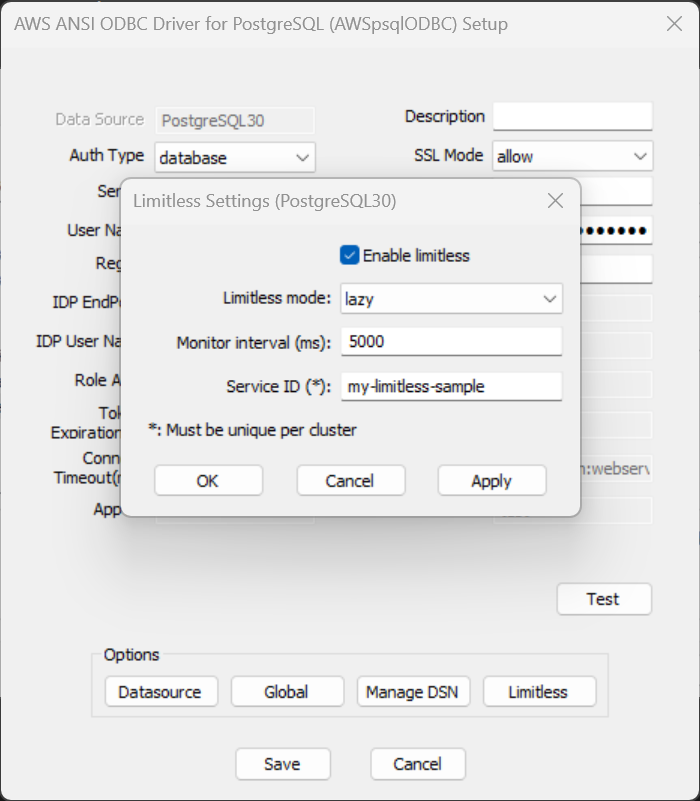
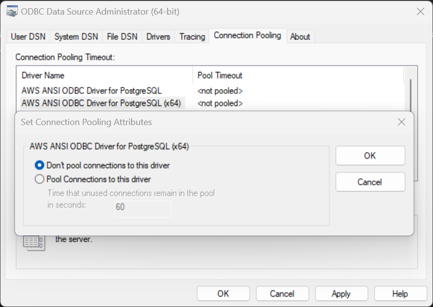

# Using the Limitless Connection Feature

## What is Amazon Aurora Limitless Database?

Amazon Aurora Limitless Database is a new type of database that can horizontally scale to handle millions of write transactions per second and manage petabytes of data. Users will be able to use the AWS PG ODBC Driver with Aurora Limitless Databases and optimize their experience using the Limitless Connection Feature. To learn more about Aurora Limitless Database, see the [Amazon Aurora Limitless documentation](https://aws.amazon.com/about-aws/whats-new/2023/11/amazon-aurora-limitless-database/).

## Why use the Limitless Connection Feature?

Aurora Limitless Database introduces a new endpoint for the databases - the DB shard group (limitless) endpoint that's managed by Route 53. When connecting to Aurora Limitless Database, clients will connect using this endpoint, and be routed to a transaction router via Route 53. Unfortunately, Route 53 is limited in its ability to load balance, and can allow uneven work loads on transaction routers. The Limitless Connection Feature addresses this by performing client-side load balancing with load awareness. 

The Limitless Connection feature achieves this by periodically polling for available transaction routers and their load metrics, and then caching them. When a new connection is made, the feature directs the connection to a transaction router selected from the cache using a weighted round-robin strategy. Routers with a higher load are assigned a lower weight, and routers with a lower load are assigned a higher weight.

## How to use the Limitless Connection Feature with the AWS PG ODBC Driver
The following DSN fields on a DSN window should be filled when using the Limitless Connection feature.

### Limitless Connection Feature Parameters

| Field            | Connection Option          | Value                                                                                                                                                                                | Default Value | Sample Value          |
|------------------|----------------------------|--------------------------------------------------------------------------------------------------------------------------------------------------------------------------------------|---------------|-----------------------|
| Enable Limitless | LIMITLESSENABLED           | Set to 1 to enable Limitless support.                                                                                                                                                | 0             | 0                     |
| Limitless Mode   | LIMITLESSMODE              | Connection strategy with Limitless.  `immediate` to allow driver to immediately switch connection to a queried router `lazy` to connect to a queried router on next connection | Null          | `lazy`                |
| Monitor Interval | LIMITLESSMONITORINTERVALMS | Limitless router query interval in milliseconds                                                                                                                                      | 5000          | 1000                  |
| Service ID       | LIMITLESSSERVICEID         | A unique identifier for each cluster                                                                                                                                                 | Null          | `my-limitless-sample` |

### DSN Window Example

### Use with Connection Pools
Connection pools keep connections open for reuse, but this can work against the client-side load-balancing of the Limitless Connection Feature and cause an imbalanced load on transaction routers. To mitigate this, consider setting connection properties that can reduce the number of idle connections or increase the lifetime of connections.

### DSN Window Connection Pool Example

## Sample Code
[Limitless Postgresql Example](limitless_sample.cpp)
