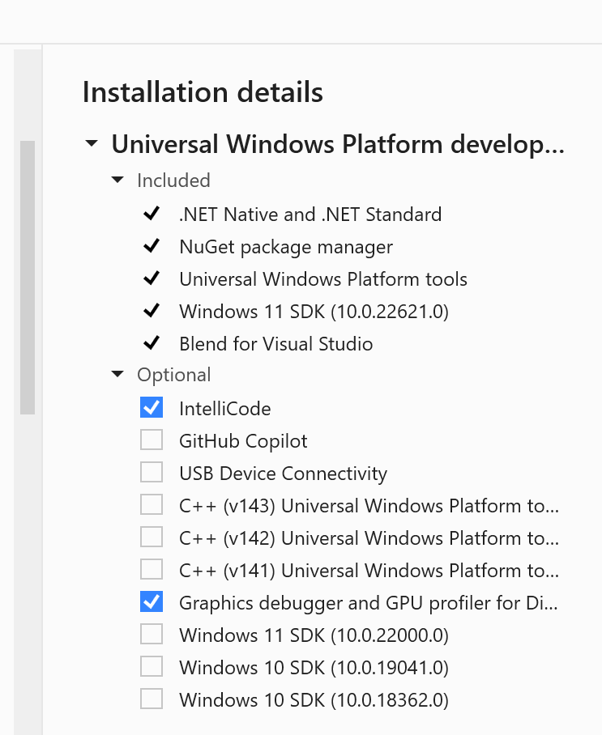
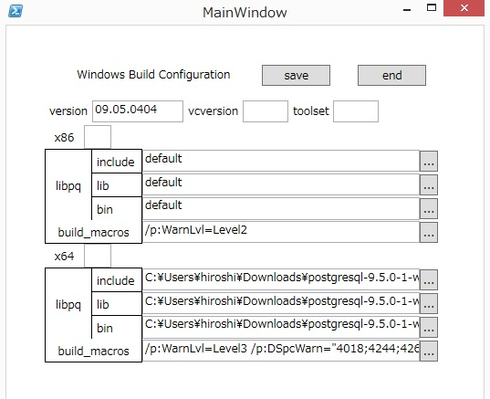

Compiling AWS SDK C++ on Windows
=============================
The PostgreSQL ODBC driver has dependency on AWS SDK C++ libraries. It is necessary to build AWS SDK C++ libraries first.

To build AWS SDK C++ static libraries for Visual Studio 2022, run the following under repository root: 

`.\scripts\build_aws_sdk_win.ps1 x64 Release OFF "Visual Studio 17 2022"`

[NOTE] Only the static AWS SDK C++ libraries are required. 

Compiling psqlODBC on Windows
=============================

This page describes how to build the PostgreSQL ODBC Driver on Windows. There are three methods to build: from command line using nmake makefiles, from Powershell using MSBuild files, and from Visual Studio IDE.

The following 3rd party software are required for the build:

*   Microsoft Windows SDK 10 (or later), or Microsoft Visual Studio 2022 Edition (or later). Other compilers may work but have not been tested. Download the latest version from [Microsoft's download page](https://visualstudio.microsoft.com/downloads/)
*   PostgreSQL Client library (libpq.dll) and headers. Download the latest version from the [PostgreSQL Binaries Download page](https://www.postgresql.org/download/).
*   WiX Toolset. Required for building the installer. Download the latest version from the [WiX Toolset website](http://wixtoolset.org/)

Building with Powershell and MSBuild
------------------------------------

  Using Powershell and MSBuild is recommended. Make sure MSBuild path is added to system environment variable `path`.

  In fact the binaries of official release are built using this mothod.

  Currently 4 Windows Powershell scripts are provided for developers.

  `winbuild/BuildAll.ps1`          - build all dlls for psqlodbc drivers using MSBuild.
  
  `winbuild/editConfiguration.ps1` - a GUI tool to set Build environment
  
  `winbuild/regress.ps1`           - build regression test programs and run
  
  `installer/buildInstallers.ps1`  - build installers(.msi and setup.exe)

  Use Powershell console or Command Prompt to invoke scripts:

  For example, to build the driver:

  `C:\psqlodbc\winbuild\> (Powershell) ./BuildAll.ps1 <options>`
 
   or you can use the same functionality from Command Prompt using Windows
    helper batch at the parent folder (..). See ..\readme_winbuild.txt.
 
  `C:\psqlodbc\> (Commnd Prompt) .\BuildAll.bat <options>`

  1. Please start a powershell console and set the ExecutionPolicy of
     Powershell to RemoteSigned or Unrestricted.

     You can get the ExecutionPolicy by typing
     
     `Get-ExecutionPolicy`
     
     When the ExectionPolicy is `Restricted` or `AllSigned` then type e.g.
     
     `Set-ExecutionPolicy RemoteSigned`

     To see details about ExecutionPolicy, type
     
     `Get-Help about_Execution_Policies`

  2. You have to install one of the following.

     . Visual Studio 2022 Community edtion

     . Windows 10 SDK
   
   The following packages should be installed.

   

   

  3. Setup Build environment

     Please type

	`.\editConfiguration(.ps1)`

     and edit the setting of your environment especially the folders
     you placed libpq related include/lib/bin files.

   	

  4. Build

     Please type
     
     `.\BuildAll(.ps1)`

     to invoke build operations.

     If you installed on x64 platform, type

        `.\BuildAll(.ps1) -P x64`

     To see details about the use of BuildAll, type
     
     Get-Help `.\BuildAll(.ps1) [-Detailed | -Examples | -Full]`

  5. Outputs of Build

     The build can produce output in up to four directories for each of
     the debug and release configurations:

     - x64_Unicode_Release     the Unicode driver, 64-bit
     - x86_ANSI_Release        the ANSI driver, 64-bit
     - x86_Unicode_Release     the ANSI driver, 32-bit
     - x86_ANSI_Release        the Unicode driver, 32-bit

     For debug builds (-Configuration Debug) the directories are named with
     Debug instead of Release but otherwise the same.

     pgxalib.dll is only built for the multibyte/unicode version, as it is
     the same for both unicode and ansi drivers.
  
  6. How to use drivers.

     You can't use psqlodbc drivers at once you build the drivers.
     Usually you have to install drivers using installers made by
     installer/buildInstallers.ps1. buildInstallers.ps1 bundles
     libpq and related libraries like ssleay32, libeay32 from the
     PostgreSQL bin directory and MSVC runtime libraries compiled with.

     However, it is painful for developers to build binaries, build
     installers and install each time the source files are changed. 
     It is recommended to use a special installation-less driver
     (postgres_devw) registered by regress.ps1

  7. Regression test in place

     After BuildAll(.ps1), please type
     
     `.\regress(.ps1)`

     You have to neither install nor copy binaries.
     By default, build 32-bit binaries from test sources and run the tests.
     If you'd like to test 64-bit version, please type
     
     `.\regress(.ps1) -P x64`

     Please note the outputs(obj, exe etc) generated by build operations and
     results of tests are placed in the directory winbuild/test\_x86(test\_x64
     in case of 64-bit).

  8. Installer
     
     To build the .msi installer file:

     C:\psqlodbc\installer\> (Powershell) `./buildInstallers.ps1 <options>`
        or
     C:\psqlodbc\> (Command Prompt) `.\buildInstallers.bat <options>`

     If you'd like to test 64-bit version, please type
     `.\buildInstallers.ps1 x64`

     By default, `buildInstallers.ps1` builds bootstrapper program
     `psqlodbc-setup.exe` together.

     See `../installer/readme.txt` in the source directory for details.

Troubleshooting:

Some documentation on dealing with Windows SDK installation issues can be found on the related pg\_build\_win page: https://github.com/2ndQuadrant/pg\_build\_win#troubleshooting

Building with nmake.exe
-----------------------
If you are building from a powershell instead of developer powershell, you need to set the following environment variables.

Get the `INCLUDE` value from developer powershell
`Write-Output $env:INCLUDE`

Get the `LIB` value from developer powershell
`Write-Output $env:LIB`

Set the `INCLUDE` with the value from developer powershell in a normal powershell
`$env:INCLUDE = ......`

Set the `LIB` value with the value from developer powershell in a normal powershell
`$env:LIB = ......`

The following environment variables need to be set before run nmake build.

Set environment environment variable `TARGET_CPU` based on your CPU architecture to `x64` or `x86`.

`$env:TARGET_CPU="x64"`

Create a `windows-local.mak` file under root repository. It should contain the following lines to set environment variables for build.

For example

```
# set PostgreSQL version
PG_VER="15.00.0000"

# set PostgreSQL bin path. The "\" should be double.
PG_BIN="C:\\Program Files\\PostgreSQL\\15\bin\\"

# set VC runtime dll with path. The "\" should be double.
VCRT_DLL="C:\\Program Files\\Microsoft Visual Studio\\2022\\Community\\VC\\Redist\\MSVC\\14.38.33130\\x64\\Microsoft.VC143.CRT\\vcruntime140.dll"

# set MSVCP dll with path. The "\" should be double.
MSVCP_DLL="C:\\Program Files\\Microsoft Visual Studio\\2022\\Community\\VC\\Redist\\MSVC\\14.38.33130\\x64\\Microsoft.VC143.CRT\\msvcp140.dll"

# set MSVC include path
MSVC_INC="C:\Program Files\Microsoft Visual Studio\2022\Community\VC\Tools\MSVC\14.38.33130\atlmfc\include"

# set SDK include path
SDK_INC="C:\Program Files (x86)\Windows Kits\10\Include\10.0.22621.0\um"

# set AWS include path
AWS_INC=C:\Users\Roy\source\repos\aws-pgsql-odbc\aws_sdk\install\include

# set AWS library path
AWS_LIB=C:\Users\Roy\source\repos\aws-pgsql-odbc\aws_sdk\install\lib
```

Use nmake.exe to build the driver for the currently active target:  
  
`C:\psqlodbc\> nmake /f win64.mak <options>`  

Despite the name, win64.mak is used to build both 32-bit and 64-bit binaries. With the Microsoft Windows SDK Command Prompt, you can switch between 32-bit and 64-bit target architectures with setenv /x86 and setenv /x64 commands. If using a Visual Studio Command Prompt you can start the x86 or x64 versions from the Start menu, or run vcvarsall.bat with appropriate options to switch architectures.

To build the .msi installer file:  

Set `POSTGRESDRIVERVERSION` firstly

`$env:POSTGRESDRIVERVERSION="09.07.0100"`

Then build the msi installer.

`C:\psqlodbc\> nmake /f win64.mak installer`  
  
The resulting installer file goes to installer/x64 or installer/x86 directory.

To build both 32-bit and 64-bit versions in one command:  
  
`C:\psqlodbc\> nmake /f win64.mak world`  
  

The following build options may be used, either on the command line, or by creating a file called `windows-local.mak`.

Variable

Values

CFG

`Release(default), or Debug`

PG_INC

`$(PROGRAMFILES)\PostgreSQL\15\include`

PG_LIB

`$(PROGRAMFILES)\PostgreSQL\15\lib`

ANSI_VERSION

`no (If set to "yes", output dll name to awspsqlodbca.dll)`

MSDTC

`yes`

1.  UNICODE is the default (awspsqlodbcw.dll), unless ANSI_VERSION is selected (awspsqlodbca.dll)
2.  libpq.dll is mandatory.
3.  If MSDTC == Yes, `pgxalib.dll` is created.
4.  If MSDTC is enabled, ANSI_VERSION also creates `pgenlista.dll`, or UNICODE creates `pgenlist.dll`.

IDE Method
----------

A Microsoft Visual Studio project file (and workspace) is included in the source tree.

**psqlodbc.sln** under `winbuild` can be used with Microsoft Visual Studio 2022. 

Preparation before the build:

The Windows distribution of PostgreSQL will install the required headers and libraries into `C:\Program Files\PostgreSQL\15`. Now PostgreSQL 15 is required.

If you want to change the installation arrangement, it is necessary to edit the project settings.

Note:

The default build settings will create the following driver:

1.  UNICODE support.
2.  libpq is mandatory.
3.  The driver filename is `awspsqlodbcw.dll`.

The build in Visual Studio could fail for the first time run. It is because the two projects has dependency on each other. The error could be like this. After rerun the build could succeed.

